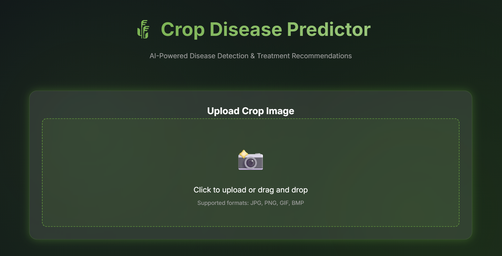
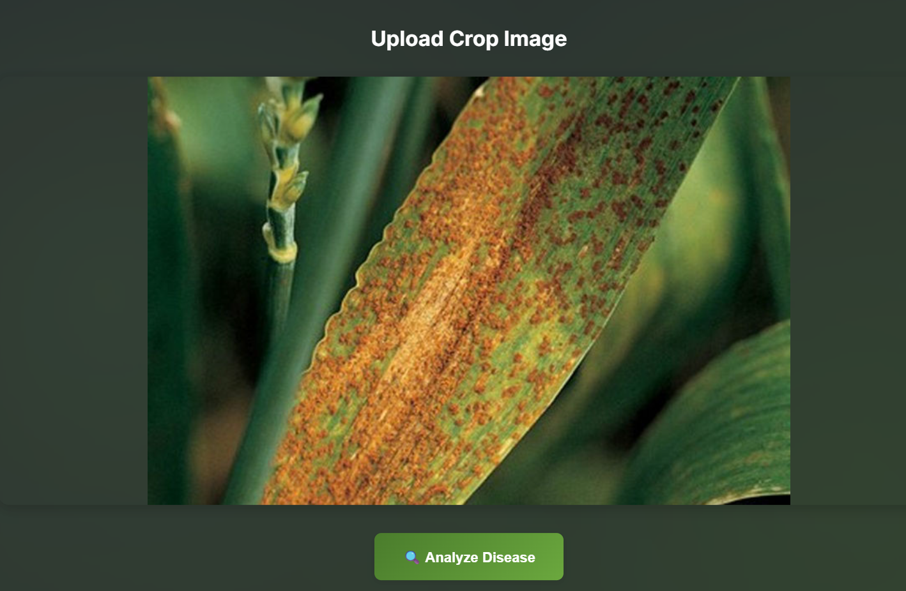
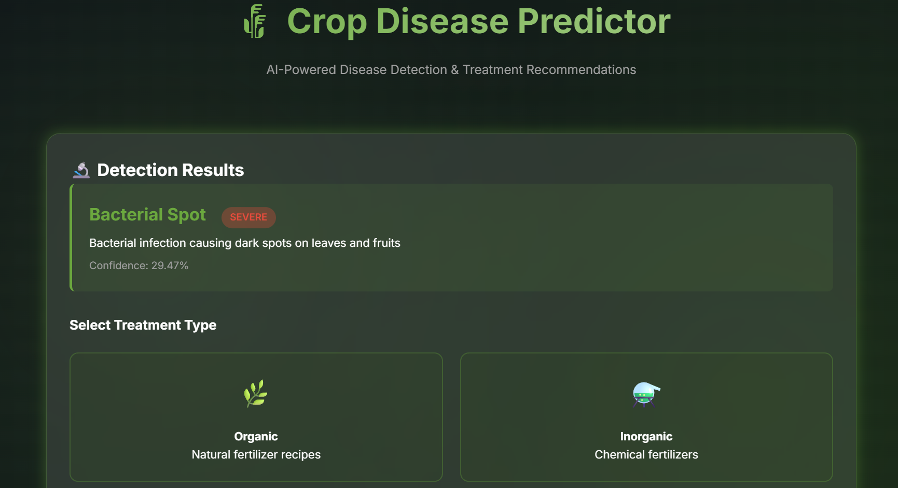

# 🌾 Crop Disease Prediction & Smart Recommendation System

A comprehensive web application that uses computer vision (OpenCV) to detect crop diseases from images and provides personalized treatment recommendations based on fertilizer type preferences (organic or inorganic). Specialized for major crops including rice, wheat, cotton, sugarcane, and maize.

## ✨ Features

- **🔍 AI-Powered Crop Disease Prediction**: Upload crop images and get instant disease identification using OpenCV
- **📊 Severity Analysis**: Automatic assessment of disease severity (mild, moderate, severe)
- **🌾 Crop-Specific Detection**: Specialized for rice, wheat, cotton, sugarcane, maize, and other major crops
- **🌿 Organic Treatment Recipes**: Detailed natural fertilizer recipes with preparation and application instructions
- **⚗️ Inorganic Dosage Calculator**: Precise chemical fertilizer calculations based on spray motor capacity
- **💎 Premium UI**: Modern glassmorphism design with smooth animations and responsive layout
- **📱 Responsive Design**: Works seamlessly on desktop, tablet, and mobile devices

## 🚀 Quick Start

### Prerequisites

- Python 3.8 or higher
- pip (Python package manager)

### Installation

2. **Install dependencies**:
   ```bash
   pip install -r requirements.txt
   ```

3. **Run the application**:
   ```bash
   python app.py
   ```

4. **Open your browser** and visit:
   ```
   http://localhost:5000
   ```

## 📖 How to Use

### Step 1: Upload Crop Image
- Click the upload area or drag and drop an image of the affected crop part (leaves, stems, grains)
- Supported formats: JPG, PNG, GIF, BMP
- Works best with images of rice, wheat, cotton, sugarcane, and maize crops

### Step 2: Analyze Disease
- Click the "Analyze Disease" button
- The system will process the image and predict the disease
- View detection results including disease name, severity, and confidence level

### Step 3: Choose Treatment Type

#### Option A: Organic Treatment
1. Select "Organic" treatment option
2. View the complete natural fertilizer recipe including:
   - Ingredients list
   - Preparation steps
   - Application instructions
   - Frequency and timing

#### Option B: Inorganic Treatment
1. Select "Inorganic" treatment option
2. Choose a chemical fertilizer from the dropdown
3. Enter your spray motor capacity (in liters)
4. Optionally specify water amount
5. Click "Calculate Dosage"
6. View detailed mixing instructions including:
   - Exact chemical amount needed
   - Water-to-chemical ratio
   - Step-by-step application guide
   - Safety precautions

## 🗂️ Project Structure

```
crop-disease-prediction/
├── app.py                      # Flask application server
├── disease_detector.py         # OpenCV-based crop disease prediction
├── treatment_advisor.py        # Treatment recommendation engine
├── requirements.txt            # Python dependencies
├── data/
│   ├── diseases.json          # Crop disease database
│   ├── organic_recipes.json   # Organic fertilizer recipes
│   └── inorganic_chemicals.json # Chemical fertilizer data
├── static/
│   ├── css/
│   │   └── style.css          # Premium styling
│   └── js/
│       └── app.js             # Frontend logic
├── templates/
│   └── index.html             # Main UI template
└── uploads/                    # Uploaded crop images storage
```

## 🔬 Supported Crop Diseases

The system can detect the following crop diseases:

1. **Leaf Blight** - Fungal disease with brown spots and lesions
2. **Powdery Mildew** - White powdery fungal growth
3. **Bacterial Spot** - Dark spots with yellow halos
4. **Rust Disease** - Orange-brown pustules
5. **Mosaic Virus** - Mottled leaf patterns
6. **Anthracnose** - Dark sunken lesions

## 🛠️ Technology Stack

- **Backend**: Flask (Python web framework)
- **Computer Vision**: OpenCV (image processing and analysis)
- **Frontend**: HTML5, CSS3, JavaScript (ES6+)
- **Styling**: Custom CSS with glassmorphism effects
- **Data Storage**: JSON files

## 🎨 Design Features

- **Glassmorphism UI**: Modern frosted glass effect with backdrop blur
- **Agricultural Color Palette**: Green and earth tones for natural feel
- **Smooth Animations**: Fade-in effects and micro-interactions
- **Responsive Layout**: Adapts to all screen sizes
- **Dark Mode**: Eye-friendly dark theme by default

## 📊 API Endpoints

- `POST /api/upload` - Upload and analyze crop image
- `POST /api/treatment/organic` - Get organic treatment recipe
- `POST /api/treatment/inorganic/options` - Get available chemical options
- `POST /api/treatment/inorganic/calculate` - Calculate chemical dosage
- `GET /api/disease/<disease_id>` - Get disease information

## ⚠️ Important Notes

- **Image Quality**: For best results, upload clear, well-lit images of affected crop parts (leaves, stems, grains)
- **Crop-Specific**: System is optimized for rice, wheat, cotton, sugarcane, maize, and similar field crops
- **Safety First**: Always follow safety precautions when handling chemical fertilizers
- **Consultation**: This tool provides recommendations but should not replace professional agricultural advice
- **Pre-harvest Intervals**: Always observe recommended waiting periods before harvesting

## 🔮 Future Enhancements

- Integration with deep learning models (CNN) for improved accuracy
- Support for more crop diseases (50+ diseases)
- Crop-specific disease models (rice blast, wheat rust, cotton boll rot, etc.)
- Multi-language support for regional farmers
- Mobile app version for field use
- User accounts and treatment history
- Community forum for farmers
- Weather-based disease prediction
- Regional disease outbreak mapping

### Example Output Image

### Example Output Image

### Example Output Image



## 📝 License

This project is created for educational and agricultural assistance purposes.

## 🤝 Contributing

Contributions are welcome! Feel free to submit issues or pull requests to improve the algorithm or add new features.


## Contact
For any questions or collaborations, reach out via  email at manoharanr4104@gmail.com.

---

**Made with 💚 for sustainable agriculture**
